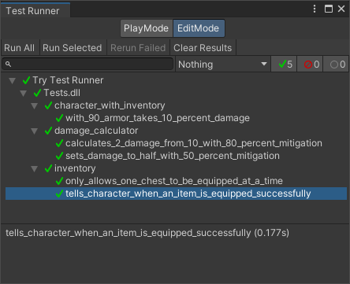

# UnityLearn-Try-Test-Runner

[[Tutorial Link]](https://youtu.be/qCghhGLUa-Y)

## Preview

## Notes

- Window > General > Test Runner
- Need to create `Scripts/Scripts.asmdef` and assign it into `Tests/Tests.asmdef`
- [NSubstitue](https://github.com/nsubstitute/NSubstitute)
- Tests.asmdef > Assembly References > NSubstitute.dll